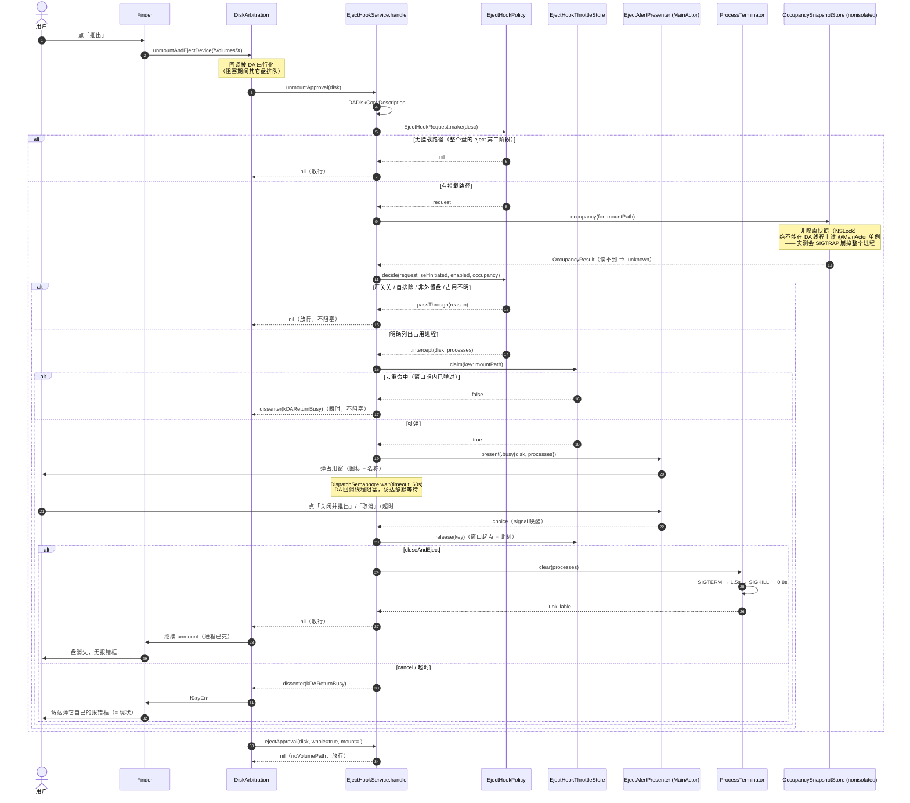

# 增量架构设计：接管访达的推出（PoC → 正式版）

> 版本：增量（基于已发布的 2026.09.24.x 线）
> 日期：2026-09-25
> 作者：高见远（架构师）
> 上游：`Design/prd/incremental-takeover-finder-eject.md`（许清楚）
> 状态：**待评审**（含 1 处对 PRD 的必要修正提案 R1，见 §8）
> 范围：**只设计本次变更**。产品全貌见 `README.md` / `SPEC.md`，本文件不重述。

---

## 0. 本次设计的三句话

| # | 结论 | 依据 |
|---|---|---|
| 1 | `handle` 必须**一分为三**：`解析`（CFType → 纯值）、`判定`（纯函数）、`执行`（阻塞/回话） | `handle` 是 `@convention(c)`、不能 await、依赖 `DADisk` 与 `@MainActor` 单例 —— 现状**一条都测不了** |
| 2 | 去重必须记在**挂载路径**上，且**只在「决定要拦」之后**才查去重 | 整个盘的 eject 回调**没有挂载路径**（本次实测），先查去重会把访达自己的推出 dissent 掉 |
| 3 | 面板高度**必须同步增长**，且新行的**中英折行数必须相同** | 实测英文余量只剩 **1.4pt**；中英折行数不同则**无解**（推导见 §6-Q4） |
| 4 | **PoC 里有两处会让功能静默失效的 P0 缺陷，必须先修**（不是「增强」，是「现在就是坏的」） | 本次真机实测：`MainActor.assumeIsolated` 在 DA 回调线程上 **SIGTRAP 崩进程**；`OccupancyStore` 懒加载 ⇒ 开关打开也可能从未启动（详见 §1.4） |

---

## 1. 实现方案与关键选型

### 1.1 分层：把「能不能测」变成结构问题

现状 `EjectHookService.handle(disk: DADisk)` 把四件事揉在一个 `@convention(c)` 函数里：

| 揉在一起的四件事 | 为什么不可测 |
|---|---|
| ① 从 `DADisk` 取描述字典 | `DADisk` 是 CFType，测试里造不出来（要真挂载一块盘） |
| ② 三关判定（自排除 / 外置盘 / 占用缓存） | 依赖 `EjectService` 静态标志与 `OccupancyStore.shared` 单例 |
| ③ 弹窗 + 信号量等用户 | 依赖主线程 + 真窗口 |
| ④ 回话（`nil` / dissenter） | 依赖 DA 的 `DADissenter` CFType |

**拆法**（判据：拆完以后，②能只喂普通 Swift 值就断言，且不需要起 app）：

```
DA 回调线程                                   纯值世界（可单测）
─────────────                                ──────────────────
handle(disk: DADisk)
  ├─ DADiskCopyDescription ─► [String: Any] ─► EjectHookRequest.make(_:)  ──┐
  │                                                                        │
  ├─ EjectService.isHookSelfInitiated ─┐                                   │
  ├─ AppSettings.takeOverFinderEject ──┼─► EjectHookPolicy.decide(…) ◄─────┘
  ├─ OccupancyStore.shared.results ────┘        │
  │                                             ├─ .passThrough(reason) ─► return nil
  │                                             └─ .intercept(disk, procs)
  │                                                      │
  ├─ EjectHookThrottle.claim(key:now:) ◄─────────────────┘
  ├─ waitForUserChoice（信号量，主线程弹窗）
  ├─ EjectHookPolicy.resolve(choice) ─► .allow / .dissentBusy
  └─ ProcessTerminator.clear(procs) ─► return nil
```

**关键收益**：`EjectHookPolicy.swift` 里**不出现 `DADisk`、不出现单例、不出现 `@MainActor`**。它是 `enum` + `struct`，`import Foundation` 即可。所有 P0-5 的判据都落在这里。

### 1.2 选型理由

| 选型 | 备选 | 为什么选它 |
|---|---|---|
| 判定抽成**自由函数**（`enum EjectHookPolicy` 的 static） | 协议 + 注入 mock 对象 | 判据是纯函数，不需要替身对象；协议只会多一层「替身是否保真」的风险（本仓库 §8.30 记过这个坑） |
| 去重抽成**值类型** `struct EjectHookThrottle`（`mutating` 方法 + 显式 `now: Date`） | 类 + 内部 `Date()` | 时间必须**从外面传**，否则「窗口边界」永远只能靠 `sleep` 测（既慢又不确定） |
| 去重状态放**进程内内存** | 落 `UserDefaults` | 跨启动的去重会让「刚重启后点推出」被静默吞掉 —— 与 B2「窗口过后能重新弹」冲突，且重启后本来就该重新问 |
| 开关**保持注册、每次回调读偏好** | 注销 / 重注册回调 | 注销有「窗口期内到达的请求完全绕过我们」的时序问题（PRD P0-2 已拍板）；且 `DASessionSetDispatchQueue` 的重调度可能与正在阻塞的回调互等 |
| 「关闭并推出」后**同步清场再放行**，不自己再推一次 | 放行后异步跑 `EjectFlowController.terminateAndEject` | 见 §1.3（本次设计最重要的一条，与 PRD §0.4 有一处冲突，已立 R1） |
| 终止策略**下沉**到 `ProcessTerminator`（`nonisolated` + 可注入 `kill`/`sleep`） | 直接调 `EjectFlowController`（`@MainActor`） | DA 回调线程**不能 await**；且要能注入假 `kill` 才能离线单测 |

### 1.3 ⚠️ 必须修正的一处：放行之后**不要**再自己推一次

**PRD §0.4 写的是「复用 `EjectFlowController.terminateAndEject`」**，PoC 也是这么做的（`runTerminateAndEject` 发 `Task @MainActor` 后立刻 `return nil`）。本次实测证明这条路有**两个推手在抢同一个卷**：

| 时刻 | 谁 | 动作 |
|---|---|---|
| t=0 | 用户点「关闭并推出」 | 弹窗返回 choice |
| t≈0 | `handle` | `Task { @MainActor in terminateAndEject }` 入队 + `return nil` |
| t≈0+ε | **访达** | 拿到 `nil` ⇒ 立刻 `unmountAndEjectDevice` ⇒ 进程**还活着** ⇒ `fBsyErr` ⇒ **访达弹它自己的报错框** |
| t≈1.5s | 我们 | 才刚发完 SIGTERM |

⇒ 「访达不弹任何报错框」（G1，本功能最大的价值点）在这条路上**大概率不成立**。

⚠️ **PRD 事实表里「点关闭并推出 ⇒ 访达不弹框（截屏实证）」这条证据不成立**：那次实证用的是 `.build/probe/da_approval_spike/block_case.sh`，而**该脚本没有起占用进程**（没有 `tail -f` keeper）—— 阻塞结束后盘本来就是空的，访达当然能推出。**「有占用时点关闭并推出 ⇒ 访达不弹框」至今没有被实证过。**

**修正方案（本设计采用）**：`closeAndEject` 时，**在 DA 回调线程上同步清场，然后放行**：

1. `ProcessTerminator.clear(processes)` —— 同步 `SIGTERM` → 等 1.5s → 对仍存活的发 `SIGKILL` → 等 0.8s；
2. 返回 `nil`（放行）⇒ 访达的 unmount 此时**进程已死**，走完正常流程 ⇒ **无报错框**；
3. **不再调用** `EjectFlowController.terminateAndEject`（避免两个 `unmountAndEjectDevice` 抢同一个卷 —— `EjectFlowController` 自己的注释 §8.146 就记着这个坑：并发调用会把一次成功写成 `notFound`）。

**代价**（如实记录）：用户点完之后，访达还要多等 ~2.3s（清场宽限）。这 2.3s 与弹窗期间一样会串行化其它盘的推出（DA 协议决定的），但它**有界**。

**它仍然算「复用既有推出流程」吗**：算 —— 复用的是**终止策略本身**（`SIGTERM → 1.5s → SIGKILL → 0.8s`，与 `EjectFlowController.terminateAndEject` 逐字相同的时序与信号），只是把它从 `@MainActor` 的编排里**下沉**成可同步调用的 `ProcessTerminator`，并且**不**由我们再推一次。`EjectFlowController.terminateAndEject` 的行为与调用方**一个字都不改**（它仍服务于主窗口 / 菜单栏那条路）。

**若 PM / 用户坚持必须调 `terminateAndEject`**：那就把 e2e 链路②（有占用 + 关闭并推出）当成**证伪实验**跑一次 —— 只要截屏里出现访达自己的报错框，即证明该路不可行，改回本方案。

### 1.4 ⚠️ PoC 里的两处 P0 缺陷（本次真机实测，必须先修）

这两条都是「PoC 跑通了」的假象 —— PoC 的 e2e 脚本**从未跑过**（`Scripts/poc_e2e.sh` 自带注释
「尚未跑过」），而单测覆盖不到 `handle` 的真机路径。两条都会让**功能静默失效**。

#### 缺陷 A：`MainActor.assumeIsolated` 在 DA 回调线程上**直接 SIGTRAP 崩掉整个进程**

现状 `EjectHookService.swift:118`：

```swift
let occupancy = MainActor.assumeIsolated {
    OccupancyStore.shared.results[mountPath] ?? .unknown
}
```

**本次实测（真机，`mainthread_probe.swift`）**：

| 观测 | 值 |
|---|---|
| 回调线程 `Thread.isMainThread` | **`false`** |
| 回调所在队列标签 | **`com.diskejector.da.approval`** |
| 在该线程调 `MainActor.assumeIsolated` | **SIGTRAP，退出码 133**（`-O` 与 `-Onone` **都崩**） |
| 崩掉之后那块盘 | `diskutil eject` 报 `ejected`、`/Volumes/SpikeVol` **消失** |

⇒ 现状代码在**第一次真的拦到推出时就崩**，而按 spike 已实证的崩溃安全性，
DA 会把「没有 approval 者」当作批准 ⇒ **盘照样推出、我们的功能一次都没生效、应用静默死掉**。
「没弹窗」的两种解释（功能没生效 / 应用已经死了）在用户看来**逐字相同**。

> 旁证：`Sources/SafeOutApp/SafeOutApp.swift` 里另外两处 `assumeIsolated`
> （`:1301`、`:1950`）都明确写在 `queue: .main` 的回调里，所以是对的 ——
> **全仓只有这一处用错了前提**。

**修法**：不要在 DA 线程上跨 actor 读。给占用结论加一份**非隔离的只读快照**
（`OccupancySnapshotStore`，`NSLock` 保护，与 `EjectService.isHookSelfInitiated` 同一套写法）：

```swift
// Sources/Services/OccupancySnapshotStore.swift（新）
/// 占用结论的**跨线程只读快照**。
///
/// **为什么不能直接读 `OccupancyStore.shared`**：它是 `@MainActor` 单例，而 DA approval
/// 回调跑在 `com.diskejector.da.approval` 队列上（**实测 isMainThread=false**）。
/// 在那里 `MainActor.assumeIsolated` 会 **SIGTRAP 崩掉整个进程**（实测退出码 133）——
/// 而崩掉之后 DA 把「没有 approval 者」当作批准，于是**盘照样推出、功能静默失效**。
enum OccupancySnapshotStore {
    private static let lock = NSLock()
    nonisolated(unsafe) private static var values: [String: OccupancyResult] = [:]

    /// 由 `OccupancyStore` 在**主 actor 上**调用（每次 `results` 变化时）。
    static func update(_ next: [String: OccupancyResult])

    /// 由 DA 回调线程调用。**读不到 ⇒ `.unknown`**（绝不能兜成 `.none`：
    /// `.none` 是「已确认无占用」，那会让「还没测出来」变成放行）。
    static func occupancy(for mountPath: String) -> OccupancyResult
}
```

`OccupancyStore` 侧只改一处：把 `results = next` / `results = [:]` 两处赋值收敛成
一个 `publish(_:)`，它同时写 `results`（给 UI）与 `OccupancySnapshotStore`（给 hook）。
**保持单一写入点**，否则快照会与 UI 分叉（正是 `OccupancyStore` 诞生时要解决的那个病）。

#### 缺陷 B：**开关打开后如果用户没开过主窗口，占用缓存永远是空的 ⇒ 功能静默不生效**

`OccupancyStore.shared` 是**懒加载单例**（「第一次有界面读它时创建并启动轮询」）。
本次核查全仓 `OccupancyStore.shared` 的触达点只有三处：

| 位置 | 什么时候发生 |
|---|---|
| `ContentView.swift`（默认参数） | **用户打开主窗口**时 |
| `SafeOutApp.swift:1594` | 用户从**菜单栏自己**发起推出时 |
| `EjectHookService.swift:119`（本缺陷 A 那行） | 拦截时（但那行会崩） |

⇒ 用户打开开关、然后**直接在访达里点推出**（正是本功能的目标场景！）时，
`OccupancyStore` 可能**根本还没被创建** ⇒ `results` 是空字典 ⇒ 读到 `.unknown` ⇒
`decide` 返回 `passThrough(.occupancyNotBlocking)` ⇒ **永远放行，一次都不拦**。
而且这条与缺陷 A 在日志上长得一样（都是「放行」）。

**修法**：把「启动占用轮询」变成一个**显式动作**，在开关为真时执行：

```swift
// @MainActor，供启动路径与设置行共用
static func syncOccupancyPolling() {
    if AppSettings.takeOverFinderEject { _ = OccupancyStore.shared }  // init 里就会 start()
}
```

| 调用点 | 为什么 |
|---|---|
| `applicationDidFinishLaunching` 末尾（紧邻 `EjectHookService.shared.register()`） | 用户上次开过开关 ⇒ 本次启动就绪，无需先开主窗口 |
| 设置行 `onTap` 里 toggle 之后 | 用户刚打开开关 ⇒ 当场就绪，不必等下次启动 |

**为什么不干脆在启动时无条件创建**：那会给**所有**用户（包括从没开过这个开关的）
每 15s 一次 `lsof` + 一次磁盘列表刷新。开关默认关，就不该有后台代价（G3）。

**为什么不做「拦到之后再启动」**：回调里做不到（非主线程、不能 await），
而且那时已经晚了 —— 这一次请求已经被放行了。

⚠️ **可接受的残余窗口**：启动后头一两秒（`DiskListStore` 首次刷新之前）快照还是空的 ⇒
读到 `.unknown` ⇒ 放行。这是**保守的正确行为**（宁可放行，也不能把「还没测出来」当成「没占用」），
不需要额外处理。

**取证（可复现）**：探针源码与输出在
`.build/probe/da_approval_spike/mainthread_probe.swift` 与同目录 `probe-out.txt`
（`.build/` 已被 gitignore，与既有 spike 同处）。复现步骤：

```bash
cd .build/probe/da_approval_spike
export DEVELOPER_DIR=/Library/Developer/CommandLineTools
/usr/bin/swiftc -swift-version 6 -O mainthread_probe.swift -o mainthread_probe
hdiutil attach spike.dmg && ./mainthread_probe > probe-out.txt 2>&1 &
sleep 2 && diskutil eject /Volumes/SpikeVol
```

---

## 2. 文件列表

### 2.1 新建

| 路径 | 一句话职责 |
|---|---|
| `Sources/Services/EjectHookPolicy.swift` | 判定层：请求解析、三关 + 开关判定、同盘去重、用户选择 → 回话决策。**纯值，不依赖 DADisk / 单例 / MainActor** |
| `Sources/Services/ProcessTerminator.swift` | 同步清场器：`SIGTERM` → 宽限 → `SIGKILL`，`nonisolated`、`kill`/`sleep` 可注入 |
| `Sources/Services/OccupancySnapshotStore.swift` | 占用结论的**跨线程只读快照**（`NSLock` 保护）—— 修缺陷 A：DA 回调线程读不到 `@MainActor` 单例 |
| `Tests/SafeOutAppTests/EjectHookPolicyTests.swift` | 上述两者的全部单测（P0-5 判据） |
| `Scripts/test/eject_hook_mutation.py` | 变异脚本（每条守卫一个变异体 + 「未变异时全绿」自检） |
| `Design/architecture/incremental-takeover-finder-eject.md` | 本文件 |
| `Design/architecture/sequence-diagram.mermaid` | 本文件 §4 时序图的独立副本 |
| `Design/architecture/class-diagram.mermaid` | 本文件 §3 类图的独立副本 |
| `.build/probe/da_approval_spike/dedup_case.sh` | Q1/Q2 实测 harness（`.build/` 已被 gitignore，与既有 spike 同处） |

### 2.2 修改

| 路径 | 改什么 |
|---|---|
| `Sources/Services/EjectHookService.swift` | `handle` 改为「解析 → 判定 → 去重 → 弹窗 → 回话」五段；接入开关、去重、清场、结构化日志；**删掉 `MainActor.assumeIsolated` 那行**（缺陷 A） |
| `Sources/Services/OccupancyStore.swift` | `results` 的两处赋值收敛成 `publish(_:)`，同时写 `OccupancySnapshotStore`（缺陷 A 的另一半） |
| `Sources/SafeOutApp/SafeOutApp.swift` | `applicationDidFinishLaunching` 末尾加 `syncOccupancyPolling()`（缺陷 B：开关为真时启动轮询） |
| `Sources/Services/EjectFlowController.swift` | 私有 `terminate(_:signal:)` 下沉到 `ProcessTerminator`，行为逐字不变（纯重构） |
| `Sources/Views/SettingsView.swift` | 「通用」组、登录启动行之后新增开关行（复用 `line(...)` + `SettingsSwitch`）；`onTap` 里 toggle 后调 `syncOccupancyPolling()` |
| `Sources/Views/DesignTokens.swift` | `Size.settingsPanel.height` 800 → **876**（依据 §6-Q4） |
| `Sources/Localization/Localizable.xcstrings` | 压缩 `takeOverFinderEjectFootnote` 的 **en**（158 → ≤ ~130 字符），使中英折行数相同 |
| `Design/ui/v2/screens/05-settings.html` | 设计稿新增同一行（否则「实现与设计稿同数」不成立） |
| `Design/ui/v2/assets/ds.css` | `--h-settings: 800px` → **876px** |
| `Tests/SafeOutAppTests/SettingsLayoutTests.swift` | 中文期望值 766.44 → 重测值；`分隔线` 期望 4 → 5 |
| `Tests/SafeOutAppTests/DocTableIntegrityTests.swift` | `docs` 加 **2** 条：`Design/prd/incremental-takeover-finder-eject.md`、`Design/architecture/incremental-takeover-finder-eject.md` |
| `Scripts/poc_e2e.sh` | 三条链路改成可判定的脚本（自动点按钮 / 自动截屏 / 自动读日志），结果落 `.build/probe/` |
| `README.md` | 能力表 +1 行；补一段「跨盘冻结」与「`diskutil eject` 同样会被接管」 |
| `SPEC.md` | 功能列表 +1 项；目录结构补 `EjectHookPolicy.swift`、`ProcessTerminator.swift`、`Scripts/poc_e2e.sh` |
| `Release-notes/<本次版本>.html` | 一条用户可见的更新说明（**不得**含 HTML 注释） |

### 2.3 不改（明确不做）

| 路径 | 为什么不改 |
|---|---|
| `Sources/Services/EjectHookService.swift` 的 `register()` | 注册逻辑本身**不动**（`DASessionSetDispatchQueue` 到 `com.diskejector.da.approval` 并发队列 + 两个回调）。**保持注册、永不注销**是本次的设计决定 |
| `Sources/Settings/AppSettings.swift` | 键与读写已就位，本次只需在注释里补一句「默认关」的既有说明，无代码改动 |
| `Sources/Services/EjectAlertPresenter.swift` | 复用现有 `present(_:)`（async 挂起）。不重新设计弹窗（PRD §0.4） |
| `Sources/Services/EjectService.swift` | `isHookSelfInitiated` 照旧（自排除的单一真相）。**不动** |
| `Package.swift` | 无新增依赖（`DiskArbitration` 是系统框架，PoC 已在用） |

---

## 3. 数据结构与接口

### 3.1 类图

```mermaid
classDiagram
    direction TB

    class EjectHookService {
        <<singleton, @unchecked Sendable>>
        -session: DASession?
        -throttle: EjectHookThrottleStore
        -static userDecisionTimeout: TimeInterval = 8
        +register() void
        -static handle(disk: DADisk) Unmanaged~DADissenter~?
        -static waitForUserChoice(disk, processes) EjectAlertChoice
        -static busyDissenter() Unmanaged~DADissenter~
    }

    class EjectHookPolicy {
        <<enum, namespace>>
        +static decide(request, isSelfInitiated, isTakeOverEnabled, occupancy) EjectHookDecision
        +static resolve(choice) EjectHookResolution
        +static shouldBlock(occupancy) [OccupyingProcess]?
    }

    class EjectHookRequest {
        <<struct, Sendable, Equatable>>
        +mountPath: String
        +volumeName: String
        +bsdName: String
        +deviceModel: String?
        +attributes: DiskClassifier.Attributes
        +static make(description: [String: Any]) EjectHookRequest?
    }

    class EjectHookDecision {
        <<enum, Sendable, Equatable>>
        +passThrough(EjectHookPassReason)
        +intercept(disk: DiskInfo, processes: [OccupyingProcess])
    }

    class EjectHookPassReason {
        <<enum, Sendable, Equatable>>
        +takeOverDisabled
        +selfInitiated
        +noVolumePath
        +notExternalVolume
        +occupancyNotBlocking
        +dedupHit
    }

    class EjectHookResolution {
        <<enum, Sendable, Equatable>>
        +allow
        +dissentBusy
    }

    class EjectHookThrottle {
        <<struct, Sendable, Equatable>>
        +window: TimeInterval
        +lastPromptEnd: [String: Date]
        +inFlight: Set~String~
        +claim(key, now) Bool
        +release(key, at) void
        +isSuppressed(key, now) Bool
    }

    class EjectHookThrottleStore {
        <<final class, @unchecked Sendable>>
        -lock: NSLock
        -value: EjectHookThrottle
        -now: () -> Date
        +claim(key) Bool
        +release(key) void
    }

    class ProcessTerminator {
        <<enum, namespace>>
        +static termGrace: TimeInterval = 1.5
        +static killGrace: TimeInterval = 0.8
        +static clear(processes, termGrace, killGrace, kill, sleep) [OccupyingProcess]
    }

    class OccupancySnapshotStore {
        <<enum, namespace, nonisolated>>
        -static lock: NSLock
        -static values: [String: OccupancyResult]
        +static update(next) void
        +static occupancy(for mountPath) OccupancyResult
    }

    class OccupancyStore {
        <<@MainActor, ObservableObject>>
        +results: [String: OccupancyResult]
        -publish(next) void
        +result(for disk) OccupancyResult
    }

    class DiskClassifier {
        <<enum, namespace>>
        +static isExternalVolume(Attributes) Bool
    }

    class DiskInfo {
        <<struct>>
        +id: String
        +mountPath: String
    }

    class OccupancyResult {
        <<enum>>
        +none
        +occupied([OccupyingProcess])
        +unknown
        +needsFullDiskAccess
    }

    class EjectAlertChoice {
        <<enum>>
        +cancel
        +closeAndEject
        +dismiss
    }

    EjectHookService ..> EjectHookPolicy : 调用
    EjectHookService ..> EjectHookRequest : 解析
    EjectHookService ..> EjectHookThrottleStore : 去重
    EjectHookService ..> ProcessTerminator : 清场
    EjectHookService ..> OccupancySnapshotStore : 读快照（非主线程）
    OccupancyStore ..> OccupancySnapshotStore : 写快照（主线程）
    EjectHookPolicy ..> EjectHookRequest : 入参
    EjectHookPolicy ..> EjectHookDecision : 返回
    EjectHookPolicy ..> EjectHookResolution : 返回
    EjectHookPolicy ..> DiskClassifier : 复用
    EjectHookPolicy ..> OccupancyResult : 入参
    EjectHookPolicy ..> EjectAlertChoice : 入参
    EjectHookDecision ..> DiskInfo : 携带
    EjectHookThrottleStore *-- EjectHookThrottle : 持有
    EjectHookRequest ..> DiskClassifier : 携带 Attributes
```



### 3.2 精确签名（`Sources/Services/EjectHookPolicy.swift`）

```swift
import Foundation

// MARK: - 请求（CFType → 纯值）

/// 一次 DA approval 回调里**做判定所需的全部输入**。
///
/// **为什么要有它**：`handle(disk: DADisk)` 拿不到可测的入参 —— `DADisk` 是 CFType，
/// 测试里只能真挂一块盘才能构造。把「取描述字典 → 提取字段」这一步单独做成
/// `make(description:)`，判据就能喂一个 `[String: Any]` 字面量进去。
struct EjectHookRequest: Sendable, Equatable {
    let mountPath: String
    let volumeName: String
    let bsdName: String
    let deviceModel: String?
    let attributes: DiskClassifier.Attributes

    /// 从 `DADiskCopyDescription` 的字典解析。
    ///
    /// - Returns: **`nil` = 取不到描述、或没有挂载路径** ⇒ 调用方必须**立即放行**。
    ///
    /// ⚠️ **「没有挂载路径」不是边界情况，是常态**：本次实测（`log-approve.txt`）——
    /// `NSWorkspace.unmountAndEjectDevice` 会触发**两个**回调：
    /// ```
    /// UNMOUNT-APPROVAL  vol=SpikeVol bsd=disk9s1 whole=false mount=/Volumes/SpikeVol
    /// EJECT-APPROVAL    vol=-        bsd=disk9   whole=true  mount=-
    /// ```
    /// 第二个是**整个盘**的 eject，它**没有卷名、没有挂载路径**。若这一步不判空，
    /// 它会被当成「一块盘」走进判定与去重 —— 而它正是访达自己推出的**第二阶段**，
    /// 把它拦下来（或去重命中后 dissent）会**直接把访达的推出打断**。
    static func make(description: [String: Any]) -> EjectHookRequest?
}

// MARK: - 判定

/// 放行的**原因**（P1-2：没有原因码，真机上「没弹窗」有两种解释且长得一模一样）。
enum EjectHookPassReason: String, Sendable, Equatable {
    /// 设置里的开关是关的（PRD P0-2：开关在**三关之前**读）。
    case takeOverDisabled
    /// 这次推出是 SafeOut 自己发起的（`EjectService.isHookSelfInitiated`）。
    case selfInitiated
    /// 取不到描述 / 没有挂载路径（含「整个盘」的 eject 回调）。
    case noVolumePath
    /// 不是外置可推出卷（`DiskClassifier.isExternalVolume` 为假）。
    case notExternalVolume
    /// 占用缓存没有**明确列出**占用进程（`.none` / `.unknown` / `.needsFullDiskAccess` / `.occupied([])`）。
    case occupancyNotBlocking
    /// 去重窗口命中（同一块盘在窗口期内已弹过一次）。
    case dedupHit
}

/// 判定结论。
enum EjectHookDecision: Sendable, Equatable {
    /// 立即回话 `nil`（放行），**不阻塞**。
    case passThrough(EjectHookPassReason)
    /// 弹占用窗 + 同步等用户决定。
    case intercept(disk: DiskInfo, processes: [OccupyingProcess])
}

/// 判定层。**纯值、无单例、无 MainActor、无 DADisk** —— P0-5 的全部判据落在这里。
enum EjectHookPolicy {

    /// 用户决策硬超时（秒）。见 §6-Q3。
    /// ✅ 2026-09-28 复核后由 60 下调到 **8**（访达的耐心实测 ≈12.5s，见 `DESIGN-SPEC §8.149`）。
    static let userDecisionTimeout: TimeInterval = 8

    /// 系统对一次 unmount 的等待上限（秒）。2026-09-28 补 —— 上面那条超时的红线由它推导。
    static let systemUnmountPatience: TimeInterval = 12.5

    /// 同盘去重窗口（秒）。见 §6-Q1。
    static let dedupWindow: TimeInterval = 30

    /// 三关 + 开关 → 结论。**顺序即优先级，不可交换**。
    ///
    /// 顺序与理由：
    /// 1. `isTakeOverEnabled` —— PRD P0-2 明写「在三关之前」；关掉时本应用在链路上
    ///    **完全不存在**（G3），连日志噪音都不该有；
    /// 2. `isSelfInitiated` —— 自排除。**必须早于任何查缓存/弹窗**：漏了它 = 自己拦自己
    ///    = 永久推不出（spike 实证）；
    /// 3. `isExternalVolume` —— 判错会把系统盘/网络卷交给用户（`DiskClassifier` 的注释）；
    /// 4. `occupancy` —— **只有明确列出占用进程才拦**（`.occupied([])` 也放行）。
    static func decide(
        _ request: EjectHookRequest,
        isSelfInitiated: Bool,
        isTakeOverEnabled: Bool,
        occupancy: OccupancyResult
    ) -> EjectHookDecision

    /// 占用结论里**该拦的进程列表**；`nil` = 不拦。
    ///
    /// 与 `EjectUI.preemptivelyOccupied` 同款判定：`.none` = 确认无占用；
    /// `.unknown` = 还没测出来（让系统自己判）；`.needsFullDiskAccess` = 用户没授权；
    /// `.occupied([])` = 系统说忙但列不出具体程序（弹空列表窗无意义）。
    /// **抽成独立函数**是为了让「四种放行」各自能被一条单测钉住 —— 写在 `decide` 的
    /// `guard case` 里时，只有「都放行」这一个整体行为可断言。
    static func shouldBlock(_ occupancy: OccupancyResult) -> [OccupyingProcess]?

    /// 用户的选择 → 回调该怎么回话。
    ///
    /// `.closeAndEject` ⇒ `.allow`（放行，由访达完成推出；调用方**先**同步清场）。
    /// 其余（`cancel` / `dismiss` / `viewLog` / …）⇒ `.dissentBusy`（退回现状）。
    ///
    /// ⚠️ **`.dismiss` 等值不可能从 busy 弹窗出来**，兜底走 dissent 是为了与
    /// 「用户没说要推出」这个语义一致 —— 放行等于**替用户做了推出这个破坏性决定**。
    static func resolve(_ choice: EjectAlertChoice) -> EjectHookResolution
}

// MARK: - 去重

/// 同盘去重：**窗口期内同一块盘至多弹一次窗**（PRD P0-3）。
///
/// **窗口起点 = 上一次弹窗结束的时刻**（无论用户点了什么）—— 因为访达的重试风暴
/// 发生在**我们回话之后**（本次实测：dissent 后 12.5s 内 7 次、间隔稳定 ~2.16s），
/// 从「开始弹窗」起算会在长决策（最长 60s）下失效。
struct EjectHookThrottle: Sendable, Equatable {
    /// 窗口长度（秒）。
    var window: TimeInterval
    /// 键 = **挂载路径**（= `DiskInfo.id`），值 = 上一次弹窗**结束**的时刻。
    var lastPromptEnd: [String: Date] = [:]
    /// 正在弹窗（回调尚未返回）的盘。防御「同一块盘的第二个请求在我们还没返回时到达」。
    var inFlight: Set<String> = []

    /// 尝试占用「这块盘的弹窗名额」。
    /// - Returns: `true` = 可以弹（**同时登记 inFlight**）；`false` = 命中去重。
    mutating func claim(key: String, now: Date) -> Bool

    /// 弹窗结束（无论用户点了什么）：解除 inFlight，并把窗口起点钉在 `now`。
    mutating func release(key: String, at now: Date)

    /// 纯查询（不写状态），供日志与单测读。
    func isSuppressed(key: String, now: Date) -> Bool
}
```

**去重键为什么是挂载路径**：`DiskInfo.id` 就是 `mountPath`（`DiskInfo` 的注释），
`OccupancyStore.results` 的键也是它。用 `volumeName` 会让「两块同名的盘」
互相去重；用 `bsdName` 会在拔插后复用（`disk9s1` 换一块盘还是它）。

**为什么不去清理 `lastPromptEnd`**：条目数 = 本进程见过的**卷数**（个位数），
且键是挂载路径 ⇒ 不会随「推出次数」增长。加一层 `prune` 只会多一段没人验证的状态逻辑。

### 3.3 去重状态的可注入包装（同文件）

```swift
/// `EjectHookThrottle` 的线程安全外壳。
///
/// **为什么需要锁**：`DASessionSetDispatchQueue` 用的是 `.concurrent` 队列，
/// 两个 approval 回调**理论上可以并发**进入（`isHookSelfInitiated` 用 NSLock 是同一个理由）。
/// 值类型 `EjectHookThrottle` 本身没有并发保护。
///
/// **为什么 `now` 可注入**：单测要能把「窗口边界」钉在确定的时刻上，
/// 而不是靠 `sleep`（慢且不确定）。
final class EjectHookThrottleStore: @unchecked Sendable {
    init(window: TimeInterval = EjectHookPolicy.dedupWindow, now: @escaping () -> Date = { Date() })

    /// - Returns: `true` = 可以弹窗；`false` = 命中去重（调用方**立即**回话，不阻塞）。
    func claim(key: String) -> Bool
    /// 弹窗结束：窗口从此刻起算。
    func release(key: String)
}
```

### 3.4 跨线程只读快照（`Sources/Services/OccupancySnapshotStore.swift`，新）

```swift
import Foundation

/// 占用结论的**跨线程只读快照**（修缺陷 A，见 §1.4）。
///
/// **为什么需要它**：`OccupancyStore` 是 `@MainActor`，而 DA approval 回调跑在
/// `com.diskejector.da.approval` 队列上（**真机实测 `Thread.isMainThread == false`**）。
/// 在那里写 `MainActor.assumeIsolated { … }` 会 **SIGTRAP 崩掉整个进程**
/// （实测退出码 133，`-O` 与 `-Onone` 都崩）；崩掉之后 DA 把「没有 approval 者」
/// 当作批准（spike 已实证）⇒ **盘照样推出、功能一次都没生效、应用静默死掉**。
///
/// **为什么不改成 `DASessionSetDispatchQueue(s, .main)`**：那样回调在主线程上，
/// 而回调是**同步阻塞**的（最长 60s 等用户）⇒ **主线程冻 60s**，界面全卡死。不可行。
///
/// **为什么不套一层信号量往主 actor 要值**：那会在 DA 回调线程上再引入一次
/// 「跨线程同步等待」，而它等的正是主线程 —— 与「主线程在等 DA 回调返回」形成
/// 互等的死锁面（`waitForUserChoice` 那条路不存在这个环，因为主线程在等的是**用户**）。
enum OccupancySnapshotStore {
    private static let lock = NSLock()
    nonisolated(unsafe) private static var values: [String: OccupancyResult] = [:]

    /// 由 `OccupancyStore` 在**主 actor 上**调用（每次结论变化时）。
    static func update(_ next: [String: OccupancyResult])

    /// 由 DA 回调线程调用。
    ///
    /// ⚠️ **读不到 ⇒ `.unknown`**（绝不能兜成 `.none`）：`.none` 是「已确认没有占用」，
    /// 那会把「还没测出来」变成放行 —— 本应用最不能犯的错误（`DiskRowState` 的注释）。
    static func occupancy(for mountPath: String) -> OccupancyResult
}
```

**写入侧只改一处**：`OccupancyStore.performDetect` 里的 `results = next` 与
`results = [:]` 两处赋值收敛成一个 `private func publish(_ next:)`，它同时写
`results`（给 UI）与 `OccupancySnapshotStore`（给 hook）。**保持单一写入点** ——
两处各写一遍必然分叉，而「两个界面看到两个结论」正是 `OccupancyStore` 诞生时要修的病。

### 3.5 同步清场器（`Sources/Services/ProcessTerminator.swift`）

```swift
import Darwin
import Foundation

/// 「礼貌退出 → 宽限 → 强制退出」的**同步**实现。
///
/// **为什么从 `EjectFlowController` 下沉出来**：
/// 1. DA approval 回调是 `@convention(c)`，**不能 await**，而 `EjectFlowController` 是
///    `@MainActor` —— 在回调线程上同步用它只能再套一层信号量，多一个死锁面；
/// 2. 清场逻辑（信号顺序、宽限时长、`EPERM`/`ESRCH` 的处理）是本仓库最危险的一段代码，
///    它需要**能离线单测**，而 `@MainActor` + 真 `kill` 让它只能靠真机验证。
///
/// **时序与信号与 `EjectFlowController.terminateAndEject` 逐字相同**（1.5s / 0.8s），
/// 所以「复用既有推出流程的终止策略」这条仍然成立。
enum ProcessTerminator {

    /// `SIGTERM` 之后的宽限（秒）—— 与 `EjectFlowController.terminateAndEject` 同值。
    static let termGrace: TimeInterval = 1.5
    /// 复检后对残留升级 `SIGKILL`，再等这段时间（秒）—— 同值。
    static let killGrace: TimeInterval = 0.8

    /// 清场。**阻塞当前线程** `termGrace + killGrace`（默认 2.3s）。
    ///
    /// - Parameters:
    ///   - kill: 注入点（默认 `Darwin.kill`）。测试注入替身即可**完全离线**断言
    ///     「谁在第几步收到了哪个信号」，不必真的 fork 进程。
    ///   - sleep: 注入点（默认 `Thread.sleep`）。测试注入空实现 ⇒ 单测**不花 2.3s**。
    /// - Returns: **关不掉的**进程（`EPERM` 等）。已消失（`ESRCH`）不算。
    nonisolated static func clear(
        _ processes: [OccupyingProcess],
        termGrace: TimeInterval = ProcessTerminator.termGrace,
        killGrace: TimeInterval = ProcessTerminator.killGrace,
        kill: (Int32, Int32) -> Int32 = { pid, sig in Darwin.kill(pid, sig) },
        sleep: (TimeInterval) -> Void = { Thread.sleep(forTimeInterval: $0) }
    ) -> [OccupyingProcess]
}
```

**自身 PID 不自杀**：与 `EjectFlowController.terminate` 同款 —— 自身 PID 计入「无法关闭」交回 UI，
否则会出现「本应用把自己杀掉」这种灾难。这条必须有一条单测。

### 3.6 `handle` 改造后的调用关系

```swift
private static func handle(disk: DADisk) -> Unmanaged<DADissenter>? {
    // ① 自排除（读静态标志，不碰 CFType）
    let selfInitiated = EjectService.isHookSelfInitiated

    // ② 解析：CFType → 纯值
    guard let desc = DADiskCopyDescription(disk) as? [String: Any],
        let request = EjectHookRequest.make(description: desc)
    else {
        log(.noVolumePath, mountPath: nil)
        return nil
    }

    // ③ 开关（在判定里最先读）
    let enabled = AppSettings.takeOverFinderEject

    // ④ 占用缓存：读**非隔离快照**（不是 `OccupancyStore.shared` —— 那会 SIGTRAP 崩，见 §1.4 缺陷 A）
    let occupancy = OccupancySnapshotStore.occupancy(for: request.mountPath)

    // ⑤ 判定
    let decision = EjectHookPolicy.decide(
        request, isSelfInitiated: selfInitiated, isTakeOverEnabled: enabled, occupancy: occupancy)

    switch decision {
    case .passThrough(let reason):
        log(reason, mountPath: request.mountPath)
        return nil

    case .intercept(let diskInfo, let processes):
        // ⑥ 去重：**只在「决定要拦」之后**才查（顺序不可交换，理由见 §6-Q2）
        guard throttle.claim(key: diskInfo.id) else {
            log(.dedupHit, mountPath: diskInfo.id)
            return busyDissenter()          // 瞬时不阻塞 —— 见 §6-Q2 的实测判据
        }
        defer { throttle.release(key: diskInfo.id) }

        // ⑦ 弹窗 + 同步等（信号量；超时回退 cancel）
        let choice = waitForUserChoice(disk: diskInfo, processes: processes)

        // ⑧ 回话
        switch EjectHookPolicy.resolve(choice) {
        case .dissentBusy:
            return busyDissenter()
        case .allow:
            // ⚠️ 先同步清场，**再**放行 —— 否则访达会在进程还活着时 unmount ⇒ 弹它自己的报错框
            let unkillable = ProcessTerminator.clear(processes)
            logClear(unkillable: unkillable, mountPath: diskInfo.id)
            return nil
        }
    }
}
```

---

## 4. 程序调用流程



---

## 5. 任务列表（按实现顺序，含依赖）

| # | 任务 | 涉及文件 | 依赖 | 优先级 | 验收点 |
|---|---|---|---|---|---|
| T01 | **判定层、清场器与跨线程快照（纯逻辑地基）** | `Sources/Services/EjectHookPolicy.swift`（新）、`Sources/Services/ProcessTerminator.swift`（新）、`Sources/Services/OccupancySnapshotStore.swift`（新）、`Sources/Services/OccupancyStore.swift`（改：`publish(_:)` 单一写入点）、`Sources/Services/EjectFlowController.swift`（改：`terminate` 下沉） | — | P0 | `swift build` 零警告；`EjectFlowController` / `OccupancyStore` 现有测试**全绿且不改断言** ⇒ 证明是纯重构 |
| T02 | **hook 接线（开关 + 去重 + 清场 + 日志）+ 修两处 PoC 缺陷** | `Sources/Services/EjectHookService.swift`、`Sources/SafeOutApp/SafeOutApp.swift`、`Sources/Settings/AppSettings.swift`（仅注释） | T01 | P0 | 读代码可逐条对上 §3.6 的八段；**`grep -rn assumeIsolated Sources/Services/EjectHookService.swift` 必须为空**（缺陷 A）；开关为真时启动即创建 `OccupancyStore`（缺陷 B，日志可见首次轮询）；开关关掉时 `handle` 在**第一段**就返回；去重命中时回话耗时 < 5ms |
| T03 | **设置面板开关行 + 高度契约同步** | `Sources/Views/SettingsView.swift`、`Sources/Views/DesignTokens.swift`、`Sources/Localization/Localizable.xcstrings`、`Design/ui/v2/screens/05-settings.html`、`Design/ui/v2/assets/ds.css`、`Tests/SafeOutAppTests/SettingsLayoutTests.swift` | — | P0 | `SettingsLayoutTests` **10 条全绿**（含新增的「中英折行数相同」判据）；`DesignSizeParityTests` 绿；开关行有 `accessibilityValue` 开/关；无写死中文；`onTap` 后 `syncOccupancyPolling()` 被调用 |
| T04 | **单测 + 变异守卫** | `Tests/SafeOutAppTests/EjectHookPolicyTests.swift`（新）、`Scripts/test/eject_hook_mutation.py`（新）、`Tests/SafeOutAppTests/DocTableIntegrityTests.swift`（docs +2） | T01、T02 | P0 | `swift test` 全绿且**总数 ≥ 514**；变异脚本输出「未变异时全绿」自检 + 每个变异体 `killed`、**存活 0**、`invalid` 0；`DocTableIntegrityTests` 3 条全绿 |
| T05 | **真机 e2e 三条链路 + 文档** | `Scripts/poc_e2e.sh`、`.build/probe/da_approval_spike/dedup_case.sh`（新）、`README.md`、`SPEC.md`、`Release-notes/<版本>.html` | T02、T03 | P0 | A1–A5 / B1–B2 / C1 各跑通一次，日志与截屏落 `.build/probe/`；`./run.sh check` 绿；`Scripts/coverage.sh` ≥ 40% |

### 5.1 T03 的高度同步必须**一次做完**（顺序不能拆）

1. 先量：在 `SettingsLayoutTests` 里临时打印加行后的 `renderedSize(SettingsSectionsColumn…)` 的**中英两个值**；
2. 若 `Δen − Δzh > 8` ⇒ **回头压英文 footnote**（这是硬约束，见 §6-Q4），重复第 1 步；
3. 定 `H = en' + 余量`（落在 `[en', zh' + 40]` 内）；
4. 同步改 `ds.css --h-settings`、`DesignTokens.Size.settingsPanel.height`、`SettingsLayoutTests` 的中文期望值（**用无头 Chrome 探针重测 `05-settings.html`**，不要手抄）、`分隔线` 期望 4 → 5；
5. 跑 `SettingsLayoutTests` + `DesignSizeParityTests`，两条都绿才算完。

---

## 6. Q1–Q5 定案 / 实测方案

### Q1 去重窗口 N = **30s（定案，附复核条件）**

**依据**（本次实测 `log-finder-dissent-busy.txt`）：dissent 后访达的重试时刻为
`+1.177 / +1.687 / +3.850 / +5.994 / +8.183 / +10.359 / +12.513`，间隔先 0.51s、
随后**稳定在 ~2.16s**；12.5s 内 7 次后脚本到点（**12.5s 之后是否还有，未观测到**）。

| 项 | 值 |
|---|---|
| 已知重试跨度 | ≥ 12.5s（7 次） |
| 单次间隔 | ~2.16s |
| 建议 N | **30s** = 12.5s + 余量（≥ 8 个间隔） |
| 复核判据 | 用 `dedup_case.sh` 的 `watch` 模式把 watcher 观察窗拉到 **120s**，记最后一次 approval 的时刻 `T_end` |
| 若 `T_end ≤ 25s` | N = 30s 维持 |
| 若 `25s < T_end ≤ 55s` | N = `ceil(T_end + 5)` |
| 若 `T_end > 55s` | **上报 PM**：去重解决不了「取消后仍被反复打扰」，只能靠开关；N 封顶 60s |

⚠️ **窗口必须从「弹窗结束」起算，不是「弹窗开始」**：长决策（最长 60s）下，
从开始起算的窗口在用户还没点按钮时就已经过期，重试会立刻再弹一次。

### Q2 去重命中 ⇒ **dissent（定案）**，但必须用实测**确认**（不得只靠推理）

**结论**：`dissent`（与 PM 建议一致）。两条理由：

1. **放行 = 替用户做决定**：用户刚点了「取消」或还没决定，此时放行等于我们批准了推出 ——
   若占用已消失，**用户的盘会在没人确认的情况下被推出**（破坏性）；
   若仍占用，访达照样报 `fBsyErr` 并弹它自己的框（多一次骚扰，还退回现状）。
2. **dissent 不会延长冻结**：跨盘冻结来自「回调里**阻塞**」，而命中去重时我们**立即返回**，
   不占用 DA 的串行通道。PM 担心的「dissent 让访达继续重试 ⇒ 冻结更久」是把
   「重试次数多」与「每次重试耗时长」混为一谈 —— 重试本身是瞬时的。

**这条结论必须用实测确认**（PM 明确要求，不得靠推理）。可执行的方案：

| 步骤 | 做法 |
|---|---|
| 1 | 给 `.build/probe/da_approval_spike/watcher.swift` 加两个 mode：`dedup-dissent`、`dedup-pass`。两者都：**第 1 次** approval 阻塞 3s 后回 dissent（模拟「用户取消」）；**之后**每次分别立即回 `dissent` / 立即回 `nil` |
| 2 | 复用 `cross_disk_case.sh` 的双盘手法写 `dedup_case.sh <dissent\|pass>`：t≈1s 用访达推 `SpikeVol`；t≈4s 用 `ejecter` 推 `Spike2Vol` 并量**墙钟耗时** |
| 3 | 观测量三样：① `Spike2Vol` 耗时（基线 <2s = 不被拖；>12s = 被拖）；② 访达在用户取消后**又弹了几次框 / 何时弹**（截屏 + AX 文本树探针读访达窗口有无 alert）；③ 最终 `/Volumes/SpikeVol` 是否消失 |
| 4 | 判据：`dedup-dissent` 分支 `Spike2Vol` 耗时 **< 2s** ⇒ dissent 不延长冻结 ⇒ **定案**；若 > 5s ⇒ 改用放行并**上报 PM**（因为放行有「替用户推出」的数据风险，这个取舍必须由产品拍） |
| 5 | `dedup-pass` 分支必须实测出「盘在用户没确认的情况下被推出」或「访达报错」二者之一 ⇒ 作为「不选放行」的**证据**落账 |

**顺序上的一个硬约束（必须写进代码注释）**：去重查询必须在 `decide` **之后**。
本次实测证明 `unmountAndEjectDevice` 会触发**两个**回调，第二个是**整个盘的 eject**
（`mount=-`）。若先去重、或对 `mount=-` 的请求也去重，就会在**访达自己推出的第二阶段**
把它 dissent 掉 ⇒ 推出失败 + 访达报错框。`EjectHookRequest.make` 返回 `nil` 是第一道防线，
「去重只在 intercept 之后」是第二道。

### Q3 60s 超时 = **暂定 60s，复核方案如下**

**已有证据**：`log-block15.txt` + `shot-block15-mid.png`（8s 时访达静默、无报错框）；
`log-block40.txt` 显示 40s 阻塞**已发起**，且 `shot-block40-mid.png`（8s）与
`shot-block40-end.png`（22s）都在 —— 但脚本在 **22s** 就 kill 了 watcher，
**40s 分支没跑完**。所以「访达的耐心 ≥ 22s」有证据，**22s–60s 之间是空白**。

| 步骤 | 做法 |
|---|---|
| 1 | `watcher.swift` 加通用 `blockN`（解析 `block70` → `Thread.sleep(70)`），并把自动退出时间从 60s 改成可配（环境变量 `RUN_SEC`，默认 120） |
| 2 | `block_case.sh 70`：t=20/45/58/66s 各截一张屏，并用 AX 文本树探针读访达窗口**有无 alert** |
| 3 | 判据：58s 时访达仍静默 ⇒ 60s 维持；若在 `T_patience < 60s` 处访达自己放弃并弹框 ⇒ 把 `EjectHookPolicy.userDecisionTimeout` 下调到 `T_patience − 5`（**同时改 footnote 文案里若有提到时长**） |
| 3′ | **✅ 已复核（2026-09-28）** —— 结论与预设**不同**：访达在 ≈12.5s 处**不弹框**，而是**放弃 unmount**（用户点了「关闭并推出」而盘推不出去）。同样触发下调：`12.5 − 5 = 7.5 ≈ 8`。实测数据、修法与守卫见 `DESIGN-SPEC §8.149` |
| 4 | 落账：`shot-block70-*.png` + `log-block70.txt` 进 `.build/probe/`，并在 Release-notes 里写明「哪份日志对应哪条链路」（D7） |

⚠️ 60s 是**我们**的信号量超时，访达的耐心是另一件事 —— 两者都量到才算复核完成。
✅ **2026-09-28 已量到**：访达的耐心 ≈ **12.5s**（两处独立实测：§8.146.3 的
`unmountAndEjectDevice` 12.5s 返回 + §8.149 的端到端 12.07s 成功 / 14.45s 失败）；
我方超时已据此下调到 **8s**（`8 + 清场 2.3 = 10.3 < 12.5`）。

### Q4 设置面板高度：**必须同步增高；且新行的中英折行数必须相同**（本次实测推导）

**实测真值**（本次跑 `swift test --disable-sandbox --filter SettingsLayoutTests` 打印）：

| 量 | 值 |
|---|---|
| 实现·中文（`TestLanguage.design` = `zh-Hans`） | **766.60pt** |
| 实现·英文 | **798.60pt** |
| 面板高 `DesignTokens.Size.settingsPanel.height` | 800pt |
| **英文余量** | **1.4pt** |
| 设计稿·中文（`SettingsLayoutTests` 的期望值） | 766.44pt |

> ⚠️ `SettingsLayoutTests` 的注释里写着「英文 782.60」—— **已过时**，实测是 **798.60**。
> 说明英文余量比注释以为的（17.4pt）还要小一个数量级。

**三条断言的公式与容差（都不变）**：

| 断言 | 公式 | 容差 |
|---|---|---|
| `面板高度放得下头部与全部四组` | `en' ≤ H` | 0 |
| `面板高度不留大片空白` | `0 ≤ H − zh' ≤ 40` | 40 |
| `中文高度与设计稿几乎逐点相同` | `abs(zh' − 设计稿中文) ≤ 2` | 2 |

**推导**：设新行让中文长 `Δzh`、英文长 `Δen`。由前两条：

```
en' ≤ H ≤ zh' + 40
⇒ 798.60 + Δen ≤ 766.60 + Δzh + 40
⇒ Δen − Δzh ≤ 8
```

一行说明文字的行高约 **15pt** ⇒ **英文比中文每多折一行就 +15 > 8**。

⇒ **硬结论：新行的说明文案，中英折行数必须相同**（多折一行即无解）。
⇒ **PM 主张的「优先压缩 footnote 文案、不放宽契约」只能满足一半**：
压缩文案是**必要**的（英文必须从 158 字符压到与中文同样的折行数），
但**不充分** —— 面板高度**必须**同步增长（最小一行 `min-height: 44pt` 也远超 1.4pt 的余量）。

**做法（顺序见 §5.1）**：

| 项 | 值 |
|---|---|
| 英文 footnote | 158 字符 → **≤ ~130 字符**（压到与中文同为 2 行）。建议起点：`Finder's eject goes through this app: it lists what holds the disk. Finder waits; other disks are deferred meanwhile.` |
| 中文 footnote | 52 字（2 行）**不动**（它是 US6「知情同意」的载体，不能再压） |
| 预期 `Δzh` / `Δen` | 各约 74pt（`44` 基础 + 2 行说明） |
| 预期新高度 | `zh' ≈ 840.6`、`en' ≈ 872.6` ⇒ **H = 876**（落在 `[872.6, 880.6]`） |
| 必须同步改 | `ds.css --h-settings: 876px`、`DesignTokens.Size.settingsPanel.height = 876`、`SettingsLayoutTests` 的中文期望（**用无头 Chrome 探针重测设计稿**）、`分隔线` 期望 4 → 5 |
| 为什么不算「放宽契约」 | 三条断言的公式、容差、量法**一个字都没改**，只是数字随内容迁移 —— 与 2026-09-18 那次 566 → 800 同源（设计稿与实现同数，由 `DesignSizeParityTests` 钉住） |

**若 876pt 在小屏上放不下**（见 R2）：退路是把**中英都压到 1 行说明**
（中文 ≤ ~28 字，会丢掉「跨盘暂缓」那句告知 ⇒ 需 PM 重新确认），此时 `Δ ≈ 59`、
`H = 860`。**不接受**的退路是放宽 40pt 那条容差。

### Q5 可测性设计（核心）：**已定案，签名见 §3**

| 现状障碍 | 解法 | 单测怎么喂 |
|---|---|---|
| `handle` 是 `@convention(c)`，不能 await | 判定全部抽成**同步纯函数**（`decide` / `resolve` / `shouldBlock`）；阻塞只剩在 `handle` 里的信号量 | 直接调 `decide`，不需要 DA |
| 依赖 `DADisk`（CFType 难构造） | `EjectHookRequest.make(description: [String: Any])` 把 CFType 挡在门外 | 喂 `[String: Any]` 字面量（含 `kDADiskDescription*Key` 的真实键名） |
| 依赖 `OccupancyStore.shared`（`@MainActor` 单例） | `occupancy: OccupancyResult` 作为 `decide` 的**入参** | 直接传 `.none` / `.unknown` / `.needsFullDiskAccess` / `.occupied([])` / `.occupied([p])` |
| 依赖 `EjectService.isHookSelfInitiated`（静态） | `isSelfInitiated: Bool` 作为入参 | 传 `true` / `false` |
| 依赖 `AppSettings`（`UserDefaults`） | `isTakeOverEnabled: Bool` 作为入参 | 传 `false` / `true` |
| 依赖 `Date()` | `EjectHookThrottle` 的每个方法都收 `now: Date` | 传构造出来的 `Date`，窗口边界可精确断言 |
| 依赖真 `kill()` 与 2.3s `sleep` | `ProcessTerminator.clear` 的 `kill` / `sleep` 可注入 | 注入记录型替身 ⇒ 断言「第几步发了哪个信号」，且**单测不花 2.3s** |

**必须有的单测清单**（每条对应 T04 的一个变异体）：

| # | 判据 |
|---|---|
| 1 | 开关关 ⇒ `passThrough(.takeOverDisabled)`，**即使**自排除为假、盘是外置、缓存有占用 |
| 2 | 开关关**优先于**自排除（顺序断言：两者同时为真时 reason 是 `takeOverDisabled`） |
| 3 | 自排除为真 ⇒ `passThrough(.selfInitiated)`，且**不读**占用缓存（用「传入 `.occupied([p])` 仍放行」证明） |
| 4 | 非外置盘 ⇒ `passThrough(.notExternalVolume)` |
| 5 | `.none` / `.unknown` / `.needsFullDiskAccess` / `.occupied([])` 四种各一条 ⇒ `passThrough(.occupancyNotBlocking)` |
| 6 | `.occupied([p])` ⇒ `intercept`，且 `DiskInfo.id == mountPath`、`processes == [p]` |
| 7 | `EjectHookRequest.make`：无 `VolumePath` ⇒ `nil`；`VolumePath` 为空串 ⇒ `nil`；有 ⇒ 五个字段逐个正确 |
| 8 | 去重：`claim` 后立刻再 `claim` ⇒ `false`（inFlight）；`release` 后 `now + 29s` ⇒ `false`；`now + 31s` ⇒ `true`；**恰好 `now + 30s`** ⇒ `true`（边界，防 `<` 写成 `<=`） |
| 9 | 去重键隔离：A 盘 `release` 后 B 盘 `claim` ⇒ `true`（键必须是挂载路径） |
| 10 | `resolve(.closeAndEject)` ⇒ `.allow`；`resolve(.cancel)` / `.dismiss` / `.viewLog` ⇒ `.dissentBusy` |
| 11 | `ProcessTerminator.clear`：全部 `SIGTERM` 成功 ⇒ **不发** `SIGKILL`；`EPERM` ⇒ 计入返回且**仍发** `SIGKILL`；`ESRCH` ⇒ 不计入 |
| 12 | `clear` 跳过自身 PID（`ProcessInfo.processIdentifier`）⇒ 返回里含它，且没对它 `kill` |
| 13 | `AppSettings.takeOverFinderEject`：键不存在 ⇒ `false`（默认关） |
| 14 | `OccupancySnapshotStore`：`update` 之后能读到；**从没 update 过的路径 ⇒ `.unknown`**（绝不能是 `.none`） |
| 15 | `OccupancySnapshotStore`：`update` 是**整体替换**（上一轮有、这一轮没有的键必须消失 —— 与 `OccupancyStore` 的口径一致，否则拔掉的盘会留着旧结论） |
| 16 | `OccupancyStore.publish(_:)` 之后，快照与 `results` **逐键相同**（单一写入点的派生关系） |

**变异脚本（`Scripts/test/eject_hook_mutation.py`）**：沿用 `Scripts/test/wait_outcome_mutation.py` 的硬规则 ——
`cp` 备份 / `cp` 还原、变异前**回读并打印**那一行证明落地、打印被测命令的原始尾部、
判红看退出码、**排掉「编译不过」与「过滤器跑 0 条」两种假红**（判为 `invalid`、不算通过）、
还原后 `cmp -s` 复核；并**自带「未变异时全绿」自检**（先跑一遍基线，非绿即退出）。
至少 10 个变异体，逐条对应上表：

| 变异 | 改什么 | 该被哪条抓住 |
|---|---|---|
| M1 | 删掉 `isTakeOverEnabled` 分支 | 1 / 2 |
| M2 | 把自排除判定的位置挪到占用缓存之后 | 3 |
| M3 | `shouldBlock` 去掉 `!processes.isEmpty` | 5 |
| M4 | 去重窗口比较 `<` 改 `<=` | 8 |
| M5 | 去重键从 `mountPath` 换成 `volumeName` | 9 |
| M6 | `resolve` 的 `cancel` 改成 `.allow` | 10 |
| M7 | `clear` 去掉 `SIGKILL` 那一步 | 11 |
| M8 | `EjectHookRequest.make` 去掉挂载路径判空 | 7 |
| M9 | `OccupancySnapshotStore.occupancy(for:)` 的兜底从 `.unknown` 改成 `.none`（正是「把还没测出来当成没占用」那条最不能犯的错） | 14 |
| M10 | `OccupancyStore.publish(_:)` 只写 `results`、不写快照（快照与 UI 分叉） | 16 |

---

## 7. 共享知识（跨文件约定）

| 约定 | 值 | 理由 |
|---|---|---|
| **去重键** | `DiskInfo.id` = **挂载路径** | 与 `OccupancyStore.results` 同键；`volumeName` 会误伤同名盘，`bsdName` 会在拔插后复用 |
| **去重窗口记在哪** | **进程内内存**（`EjectHookThrottleStore`），**不落 `UserDefaults`** | 跨启动去重会把「刚重启后点推出」静默吞掉 |
| **窗口起点** | 上一次**弹窗结束**的时刻（`release` 时钉） | 访达的重试发生在**我们回话之后** |
| **窗口值** | `EjectHookPolicy.dedupWindow` = 30（单一常量，只在这里写） | 与 `EjectHookService` 的 `userDecisionTimeout` 并列放在判定层，便于一处复核 |
| **日志 category** | `subsystem: com.safeout.app`、`category: EjectHook` | 与 PoC 一致；`log show --predicate` 的命令已经在 `poc_e2e.sh` 里 |
| **日志必打的行** | 每次回话**一条**：`放行 reason=<EjectHookPassReason.rawValue> mount=<path>` 或 `拦截 mount=<path> 占用=<n>`；弹窗结束打 `choice=<x> 阻塞=<t>s`；清场打 `SIGTERM <n> → 存活 <m> → SIGKILL` | P1-2：真机上「没弹窗」有两种解释（去重生效 / hook 没注册），**长得一模一样** |
| **开关语义边界** | 只控制「**要不要弹窗拦这一块盘**」。**自排除**与**无挂载路径放行**永远生效，与开关无关 | 关掉开关也必须能推出自己的盘（G3：与没装这个应用一样，但更不能把自己卡死） |
| **开关读法** | 每次回调读 `AppSettings.takeOverFinderEject`（`UserDefaults.bool`），**不缓存** | 「改了即时生效不重启」（P0-2）；缓存一份就多一个会漂的真相 |
| **注册状态** | 启动时注册一次，**永不注销** | PRD P0-2 已拍板 |
| **超时常量** | `EjectHookPolicy.userDecisionTimeout` = **8**（2026-09-28 复核 Q3 后由 60 下调；同处新增 `systemUnmountPatience` = 12.5） | 与去重窗口同处一个 `enum`，复核时一起看。红线：**决策 + 清场 2.3s < 12.5s**（`DESIGN-SPEC §8.149`） |
| **终止时序** | `SIGTERM` → 1.5s → 复检 → `SIGKILL` → 0.8s；**自身 PID 不杀** | 与 `EjectFlowController.terminateAndEject` 逐字相同（下沉，不改行为） |
| **`MainActor` 边界** | `handle` 在 DA 队列（**非主线程**）上跑。**禁止**在它里面读任何 `@MainActor` 成员（含 `MainActor.assumeIsolated`）—— 实测 SIGTRAP 崩进程；占用结论一律走 `OccupancySnapshotStore`。弹窗走 `Task { @MainActor in … }` + 信号量 | 见 §1.4 缺陷 A（真机实证） |
| **占用缓存就绪** | 开关为真时，**启动**与**开启开关**两个时刻都必须 `syncOccupancyPolling()`；否则缓存永远为空 ⇒ 一律放行 ⇒ 功能静默失效 | 见 §1.4 缺陷 B |
| **快照兜底值** | `OccupancySnapshotStore.occupancy(for:)` 读不到 ⇒ **`.unknown`**，绝不是 `.none` | `.none` = 已确认无占用 |
| **测试语言** | 布局断言一律 `TestLanguage.with`（默认 `zh-Hans`），禁止依赖 `Locale.current` | 已有纪律（CI 是英文） |
| **`.md` 扫描范围** | 本文件与 PRD 都必须进 `DocTableIntegrityTests.docs` | 见 §9 |

---

## 8. 待明确事项

| # | 事项 | 影响 | 建议处理 | 谁来定 |
|---|---|---|---|---|
| R1 | **PRD §0.4「复用 `terminateAndEject`」与 G1「访达不弹报错框」冲突**（§1.3） | 本功能最大的价值点可能不成立 | 采用本设计的「同步清场 + 放行」；若坚持原路，用 e2e 链路②当**证伪实验**（弹框即证伪） | 架构师 + PM |
| R2 | **面板 800 → 876 后，小屏放得下吗**（1440×900 的屏可用高约 876pt，恰好占满） | 真机上可能出现窗口被裁 / 底部内容看不到 | 真机在最小支持分辨率上开一次设置窗（`SettingsWindowTests` 只钉窗口尺寸 = token，钉不住「屏幕上放得下」）；放不下则走 §6-Q4 的 1 行退路 | 架构师 |
| R3 | **`zh-Hant` 的 footnote 是 65 字**（比 `zh-Hans` 的 52 字长），可能多折一行 | 繁中用户在真机上可能看到被裁的行 | 工程师需确认没有用例在 `zh-Hant` 下量设置面板高度；若有，`zh-Hant` 也要压到与 `zh-Hans` 同折行数 | 工程师 |
| R4 | **清场那 ~2.3s 期间 `activeEjectionCount` 没登记** ⇒ 「后台更新并重启」那条路可能在这 2.3s 里重启 app | 极小概率打断一次推出（与「正在推出的磁盘不会被打断」的承诺有一处窄缝） | 可选：给 `EjectFlowController` 加一对 `nonisolated` 的 `beginExternalEjection()` / `endExternalEjection()`，让 hook 在清场期间也登记；本版可只记入 SPEC 的已知边界 | 架构师 + PM |
| R5 | **`ejectApproval`（整个盘）在真实外置硬盘上的形状**：spike 只在磁盘映像上验过 `mount=-` | 若某类设备给出非空 `mountPath`，去重/拦截会作用到第二阶段 | e2e 时用真 USB 盘跑一次，把两个回调的字段打进日志核对；若出现非空 `mountPath`，需按 `kDADiskDescriptionMediaWholeKey == true` 显式放行 | 工程师 |
| R6 | Q1 的 `T_end`（访达重试的真实终点）与 Q3 的 `T_patience`（访达的耐心）**都还没量到** | 30s 与 60s 都只是暂定 | 按 §6-Q1 / §6-Q3 的脚本量出来，结果写回本文件 | 工程师 + 架构师 |

---

## 9. 两个工程影响的处理方式

### 9.1 新 `.md` 进 `DocTableIntegrityTests.docs` 列表（**不要 gitignore**）

`Tests/SafeOutAppTests/DocTableIntegrityTests.swift:76` 的 `docs` 是**手写清单**，
而同一文件的 `扫描范围必须覆盖所有会被提交的文档` 会用
`git ls-files --cached --others --exclude-standard '*.md'` 反查「凡在范围内的 `.md` 都要在列表里」。
本次新增**两个**被跟踪的 `.md` ⇒ 必须**两条一起加**，否则该守卫判红：

```swift
private static let docs = [
    "Design/ui/v2/DESIGN-SPEC.md",
    "Design/prd/incremental-takeover-finder-eject.md",          // 新增（PM 的 PRD）
    "Design/architecture/incremental-takeover-finder-eject.md", // 新增（本文件）
    "SPEC.md",
    "README.md",
    "Release-notes/README.md",
]
```

**不要**把 PRD / 架构文档挪进 `.gitignore` 覆盖的目录 —— 那样它们就不再是项目文档，
且 `tracked.count >= 4` 的正向锚会失去意义（§8.105 的教训）。

⚠️ **本文件自己也要遵守表格完整性**：所有表格行必须与表头**列数相同**、单元格内不得出现
未转义的 `|`、单元格内不得换行（要换行用 `<br>`）。本文件已按此写。

### 9.2 设置面板高度契约

**处理方式：同步增高（876），并同步设计稿；不放宽任何容差。** 完整推导见 §6-Q4，
执行顺序见 §5.1。要动的四处（**必须一起动**）：

| 文件 | 改什么 |
|---|---|
| `Design/ui/v2/assets/ds.css` | `--h-settings: 800px` → `876px` |
| `Sources/Views/DesignTokens.swift` | `Size.settingsPanel = CGSize(width: 480, height: 876)` |
| `Design/ui/v2/screens/05-settings.html` | 新增「接管访达的推出」行（`data-i` 用已在 `xcstrings` 里的两个键，`DesignDraftIntegrityTests` 才认） |
| `Tests/SafeOutAppTests/SettingsLayoutTests.swift` | ① 中文期望 766.44 → **重测值**；② `分隔线只画在卡片内的行与行之间` 期望 **4 → 5**（通用卡 3 行 → 4 行，多一条行间线） |

`DesignSizeParityTests` 的两条（`--w-settings` / `--h-settings`）会**自动跟着 `ds.css` 走**，
不需要单独改期望值 —— 但必须确认它绿。

### 9.3 门槛清单（T05 收尾必跑）

| 命令 | 判据 |
|---|---|
| `source Tools/clt_swift_env.sh` | 每条 swift/git 命令之前 |
| `swift build --disable-sandbox` | 零警告 |
| `swift test --disable-sandbox` | 全绿，总数 **≥ 514**（只增不减） |
| `python3 Scripts/test/eject_hook_mutation.py` | 每个变异体 `killed`、**存活 0**、`invalid` 0；含「未变异时全绿」自检 |
| `Scripts/coverage.sh` | Models / Services / Settings ≥ 40% |
| `./run.sh check` | 绿 |
| `bash Scripts/poc_e2e.sh` | A1–A5 / B1–B2 / C1 各一次，日志 + 截屏落 `.build/probe/` |
